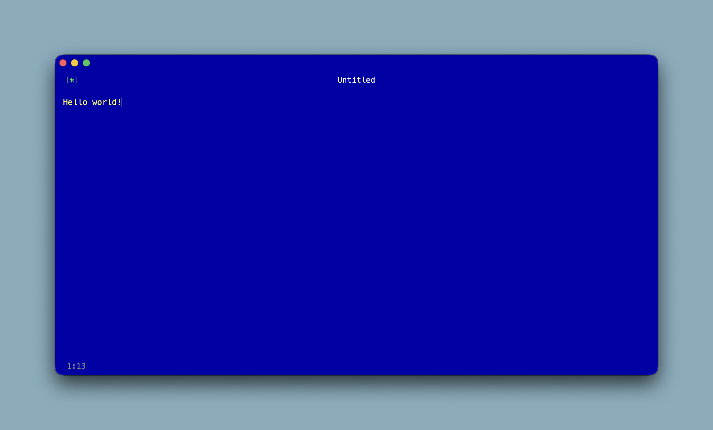

# Blue

A minimalist text editor inspired by the Turbo Pascal and Turbo Basic editors of the late 1990's.

Try it: <https://codazoda.github.io/blue/>




## Running Locally

Blue has no build step. Serve the project directory with any static file server, for example:

```
npx serve
# or
python3 -m http.server 3000
```

Then open `http://localhost:3000/`. Opening `index.html` directly via `file://` will not work because the JS modules require an `http://` or `https://` origin.


## Configuration

Blue has two user-configurable files:

**`blue.css`** — color theme. Edit these CSS custom properties:

- `--editor-bg` — editor background (default `#0000aa`, Turbo Pascal blue)
- `--editor-fg` — editor text and caret (default `#ffff55`, Turbo Pascal yellow)
- `--editor-highlight` — status bar text and rules (default `#ffffff`)
- `--editor-dark` — position indicator and dim accents (default `#888888`)

**`blue.json`** — behavior options:

- `wordWrap` (boolean): `true` to wrap long lines (default), `false` for horizontal scrolling.

All other styling lives in `css/main.css`.


## Keyboard Shortcuts

- F1 → Toggle the help
- F2 → Rename current file
- Cmd/Ctrl+N → New file
- Cmd/Ctrl+O → Open file
- Cmd/Ctrl+S → Save
- Cmd/Ctrl+Shift+S → Save As
- Cmd/Ctrl+K, S → Save (chord)
- Cmd/Ctrl+K, O → Open (chord)
- Tab / Shift+Tab → Indent / Outdent
- Enter → Auto-indent new line

- Save As uses the OS file picker via the File System Access API when available; otherwise it falls back to a download prompt.


## Built to Last

Blue is built to last. It is created with pure HTML, JavaScript, and CSS. It has no third party dependencies.

All code is written in distinct functions. Functions remain as small as possible.

Use blue/green test driven development and test every function.

Write unit tests using a dependency-free browser test harness. Requirements:

- Single tests.html file I can open with file:// — no Node, no build step, no npm packages.
- Inline <script type="module"> that defines test(name, fn), assert(cond, msg), and assertEq(a, b) on globalThis, then imports the test files.
- Render results as a list: green "ok — name" on pass, red "FAIL — name: message" on fail. Set document.title to a pass/fail summary.
- Support async test functions and catch thrown errors per-test (one failure shouldn't stop the run).
- Tests live in tests/*.test.js and may touch document/window directly.
- Keep the harness under 40 lines.


## Visual Design

- There are several standard colors: foreground (#ffff55), background (#0000aa), highlight (#ffffff), bright (#00ff00), and dark (#888888).
- The editor fills the whole browser view space.
- Two horizontal rules in the highlight color span edge-to-edge: a Top Rule and a Bottom Rule.
- The Status Indicator, Title, and Position Indicator sit *inline* with the rules at the same vertical center — the rule visually breaks on either side of each label, leaving a small gap so the label appears to interrupt the line (e.g. `──── Untitled ────`).
- Status Indicator: on the Top Rule, 2em from the left. Defaults to `[ ]`; becomes `[*]` when the file is dirty. Brackets render in `dark`; the `*` renders in `bright`.
- Title: centered horizontally on the Top Rule. Defaults to `Untitled`. Renders in `highlight`.
- Position Indicator: on the Bottom Rule, 2em from the left, formatted `row:column` (e.g. `3:19`). Renders in `dark`.
- The background is blue (`background` in the css and #0000aa).
- The foreground is yellow (`foreground` in the css and #ffff55).
- The top and bottom rules are white (`highlight` in the css and #ffffff).
- The tab key should indent a line and subsequent lines should be indented to the same level.


## Help Menu

The help menu is a modal. It shows each of the keyboard shortcuts. Clicking on any shortcut runs that shortcuts action. This allows mobile users to open a menu by clicking on the edit indicator and then perform any action with a click instead of a keystroke. Designed mainly for systems without keyboards, like smart phones.

When the help modal is opened the background is darkened.

The modal has a title of "HELP" then lists each of the keyboard shortcuts offered by the program.

At the bottom it says "Press F1 or Esc to close". Clicking or tapping outside of the modal also closes.


## PWA

Blue has a manifest so that it can run as a PWA.


## Mouse / Finger Navigation (TODO)

Blue opens the help modal when you click on the Status Indicator ([*]).

Clicking any of the keyboard shortcuts will close the modal and run that action.


## TODO

- [x] Clicking the status area should open the help dialog.
- [x] Swap actions, like "Open file", to the left of the help dialog, key combinations to the right (like a menu).
- [x] Use symbols instead of Cmd/Ctrl for key combinations in the help dialog (i.e. ⌘ S).
- [x] Add spaces between help dialog key combinations (i.e. "^ S").
- [x] Seperate the indent/outdent options to be on their own line in the help dialog.
- [x] Use "Help" instead of "Toggle this help" and "Rename file" instead of "Rename current file".
- [x] Remove new line from the help menu.
- [x] Make the keyboard shortcuts the dark color.
- [x] Remove the chord options from the help dialog (leave the key combinations).
- [x] Make the help menu items clickable to do that action, like a menu.
- [ ] Add a config option to blue.json to support an open-file URL (see ../open-file).
- [ ] If the url setting is set the save feature should save the file via that API.
- [ ] If the url setting is set the open feature should list all files in a modal similar to the help modal.
- [ ] There should be a search box at the top of the file modal that narrows to the list to any that match.
